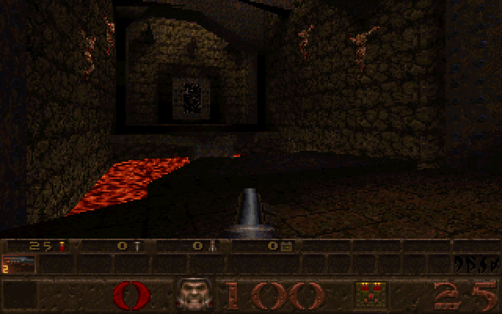
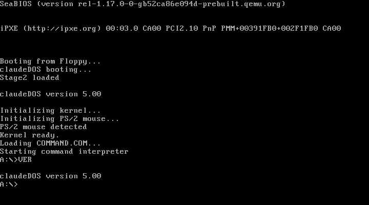

# ClaudeDOS

A DOS-compatible operating system written entirely in x86 real-mode assembly (NASM). Built from scratch — bootloader, kernel, FAT12/FAT16 filesystem, memory manager, XMS driver, COMMAND.COM shell — all the way up to running the original 1996 Quake.



## It Runs Quake

ClaudeDOS implements enough of the DOS API, DPMI infrastructure, and XMS memory management to run id Software's Quake via DJGPP's go32 extender and CWSDPMI:

```
make run-quake     # Boot from floppy, Quake on 32MB hard disk
```

At the `A:\>` prompt, type `C:` then `QUAKE`. The go32 stub auto-loads CWSDPMI as a TSR, enters 32-bit protected mode, and launches the game.

## Quick Start

### Prerequisites

- NASM (Netwide Assembler)
- Rust/Cargo (for the disk image builder)
- QEMU (`qemu-system-i386`)

### Build and Run

```bash
make          # Build 1.44MB floppy image
make run      # Launch in QEMU
```



### More Targets

```bash
make hd              # Build 32MB FAT16 hard disk image
make run-hd          # Boot with floppy + hard disk (C:)
make run-quake       # Boot with Quake (32MB RAM)
make run-serial      # Boot with serial console
make debug           # Boot with GDB stub (port 1234)
```

## Features

### Kernel (IO.SYS)

- Two-stage bootloader (VBR + stage2) loads kernel from FAT12
- **85 of 109 INT 21h functions** implemented (00h-6Ch)
- FAT12 (floppy) and FAT16 (hard disk) with subdirectory support
- MCB memory manager with first-fit/best-fit/last-fit strategies
- XMS 3.0 driver with chunked block moves (no size limit)
- .COM and .EXE program loading with relocations and overlays
- TSR support (Terminate and Stay Resident)
- Device drivers: CON, NUL, AUX, PRN, CLOCK$, RAMDISK
- PS/2 mouse driver (INT 33h)
- CPU exception handlers with faulting address display

### Shell (COMMAND.COM)

**18 internal commands:**
CD, CLS, COPY, DATE, DEL, DIR, ECHO, HELP, MD, PATH, PROMPT, RD, REN, SET, TIME, TYPE, VER, VOL

**I/O:**
Output redirection (`>`, `>>`), input redirection (`<`), pipes (`DIR | FIND "TXT"`), command-line editing with history

**Batch files:**
REM, ECHO, PAUSE, GOTO, IF/ELSE (EXIST, ERRORLEVEL, string comparison, NOT), CALL, SHIFT, FOR loops, `%0`-`%9` parameters, `%VARNAME%` environment variables. AUTOEXEC.BAT runs at startup.

### External Utilities

BEEP, CHKDSK, FIND, FORMAT, MEM, MORE, SORT, SYS

### INT 21h Coverage

| Range | Functions |
|-------|-----------|
| 00h-0Eh | Program terminate, character I/O, buffered input, disk reset, drive selection |
| 0Fh-17h | FCB open/close/find/read/write/create/rename |
| 19h-2Fh | Drive info, DTA, vectors, parse filename, date/time |
| 30h-36h | DOS version, TSR, break flag, InDOS, vectors, disk free space |
| 39h-47h | Mkdir/rmdir/chdir, create/open/close/read/write/delete/seek, attributes, IOCTL, dup, CWD |
| 48h-52h | Memory alloc/free/resize, EXEC, exit, return code, find first/next, PSP, SysVars |
| 56h-6Ch | Rename, file timestamps, allocation strategy, extended error, truename, extended open |

## Project Structure

```
boot/                 VBR and stage2 bootloader
kernel/
  inc/                Constants, structures, macros
  mem/                MCB allocator, XMS 3.0 driver, UMB stubs
  fat/                FAT12/FAT16 drivers, path resolution, sector cache
  int21h/             DOS service handlers (dispatch, char_io, file_io, fcb, memory, process, disk, misc)
  exec/               Program loaders (COM, EXE), PSP builder, environment block
  device/             Device drivers (CON, NUL, AUX, PRN, CLOCK$, RAMDISK)
shell/
  command.asm         Main loop, command dispatch, PATH search
  internal/           18 built-in commands
  redirect.asm        I/O redirection and pipe support
  batch.asm           Batch file interpreter with variable substitution
utils/                External .COM utilities (BEEP, CHKDSK, FIND, etc.)
tests/                Test programs
tools/                Rust disk image builder (FAT12 floppy + FAT16 hard disk)
scripts/              Automated test harness and diagnostic tools
docs/                 Error code reference, screenshots
```

## Testing

```bash
./scripts/test_harness.sh boot    # Boot sequence
./scripts/test_harness.sh dir     # DIR / FindFirst/FindNext
./scripts/test_harness.sh exec    # Program execution (.COM + .EXE)
./scripts/test_harness.sh file    # File I/O (create, read, write, seek)
./scripts/test_harness.sh find    # FindFirst/FindNext API
```

## Technical Details

| | |
|-|-|
| **Target** | 8086/186 real mode |
| **DOS version** | 5.00 |
| **Floppy** | 1.44MB FAT12, 1 sector/cluster |
| **Hard disk** | 32MB FAT16, 8 sectors/cluster (4KB) |
| **RAM disk** | Drive D:, FAT12 |
| **Conventional memory** | Up to 640KB with MCB chain |
| **Extended memory** | Up to 16MB via XMS 3.0 |
| **File handles** | 20 per process (expandable via AH=67h) |
| **SFT entries** | 40 system-wide |
| **Assembler** | NASM (Netwide Assembler) |

## How It Works

The boot sequence: BIOS loads the VBR from the floppy's boot sector. The VBR loads stage2, which finds IO.SYS in the root directory, loads it, and jumps to the kernel entry point. The kernel initializes memory (MCB chain), installs interrupt handlers (INT 20h-2Fh, INT 33h), sets up the SFT and DPB structures, detects the hard disk, initializes the XMS driver, and finally loads COMMAND.COM.

When you type `QUAKE` at the prompt, COMMAND.COM searches PATH, finds QUAKE.EXE on C:, and calls INT 21h AH=4Bh (EXEC). The EXE loader reads the MZ header, loads the image cluster-by-cluster across segment boundaries, applies relocations, and jumps to the entry point. The go32 stub inside quake.exe checks for DPMI (INT 2Fh AX=1687h), doesn't find it, so it EXECs CWSDPMI.EXE which installs as a TSR (INT 21h AH=31h) hooking INT 2Fh and INT 31h. The go32 stub detects DPMI is now available, enters 32-bit protected mode, reopens quake.exe to read the COFF payload via DOS file I/O, allocates extended memory through DPMI, and launches the Quake engine.

## Built With

This entire operating system — every line of assembly, the bootloader, kernel, shell, utilities, FAT drivers, memory manager, XMS driver, DPMI support, and the Rust disk image tooling — was written by [Claude Code](https://claude.ai/claude-code), Anthropic's AI coding agent.

## License

MIT
